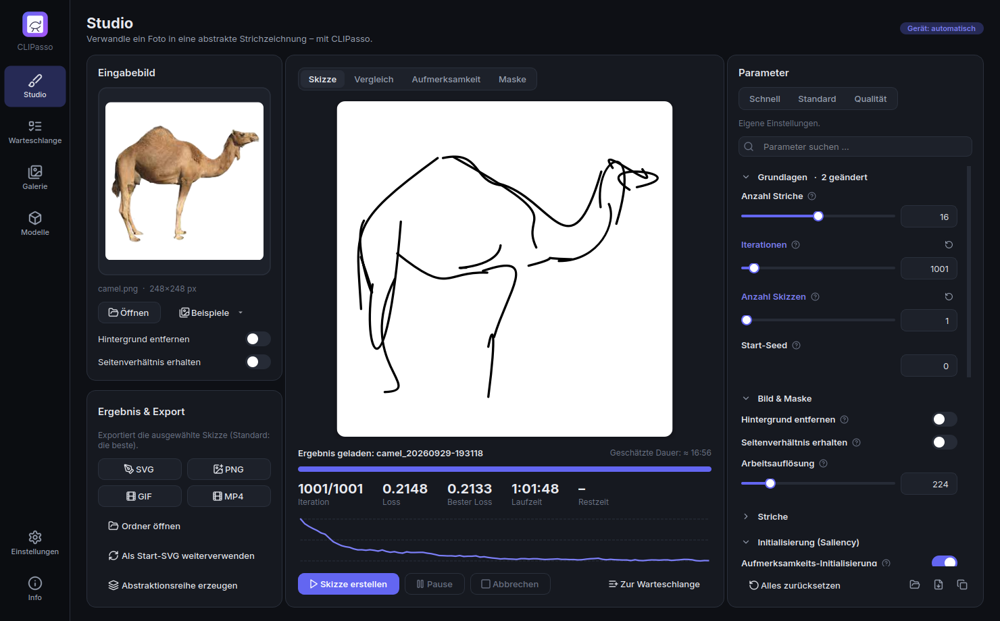
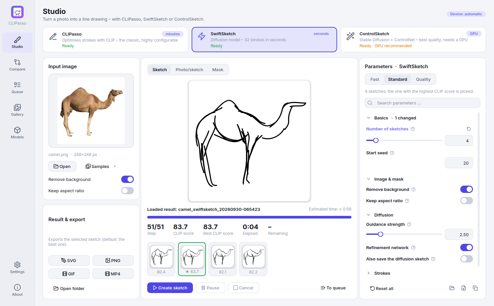
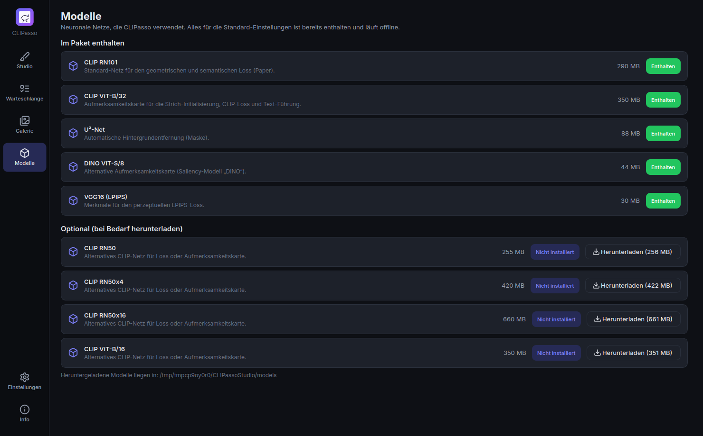

<p align="center">
  
</p>

<h1 align="center">CLIPasso Studio</h1>

<p align="center">
  Desktop-App für <a href="https://github.com/yael-vinker/CLIPasso"><b>CLIPasso: Semantically-Aware Object Sketching</b></a> (SIGGRAPH 2022)<br>
  Fotos werden zu abstrakten Strichzeichnungen – mit moderner Oberfläche, alle Funktionen einstellbar, alles in einer EXE.
</p>

<p align="center">
  <a href="https://github.com/Junostr05/Junostr05/releases/latest"><b>⬇ Download (Windows)</b></a> ·
  <a href="#funktionen">Funktionen</a> ·
  <a href="#bedienung">Bedienung</a> ·
  <a href="#english">English</a>
</p>

<p align="center">
  
  
</p>
<p align="center"><sub>Mit dieser App erzeugt: 16 Striche, 1001 Iterationen, CPU – links der Zeichenprozess (GIF-Export), rechts das Ergebnis.</sub></p>



## Download

Auf der [Release-Seite](https://github.com/Junostr05/Junostr05/releases/latest) liegen drei Varianten:

| Datei | Beschreibung |
|---|---|
| **`CLIPassoStudio-CPU-Portable.exe`** | Eine einzige Datei: herunterladen, doppelklicken, fertig. Keine Installation, keine Python-Umgebung, alle Modelle sind enthalten (≈ 1,2 GB). Beim Start wird kurz entpackt (15–40 s, mit Splash-Screen). |
| **`CLIPassoStudio-CPU-Setup.exe`** | Dieselbe App als Installer: einmal installieren, danach schneller Start, Startmenü- und Desktop-Verknüpfung. Keine Admin-Rechte nötig. |
| **`CLIPassoStudio-GPU-Setup.exe`** + `…-GPU-Setup-*.bin` | Edition für NVIDIA-Grafikkarten (CUDA 12.8: GeForce GTX 16xx / RTX 20xx oder neuer, aktueller Treiber ≥ 570), 10–50× schneller. Weil sie größer als 2 GB ist, besteht sie aus mehreren Dateien: **alle in denselben Ordner laden** und die `Setup.exe` starten. Ohne passende GPU (z. B. GTX 10xx) rechnet sie automatisch auf der CPU. |

> Windows SmartScreen warnt eventuell vor einem „unbekannten Herausgeber“ (die EXE ist nicht signiert) → *Weitere Informationen* → *Trotzdem ausführen*.

## Funktionen

- **Alle Optionen des Originals** in der Oberfläche: jedes Argument von `run_object_sketching.py` und `config.py` (Striche, Iterationen, Skizzenanzahl, Seeds, Maske, Seitenverhältnis, Arbeitsauflösung, Strichbreite, Segmente, Kurventyp, Start-SVG, Saliency CLIP/DINO, XDoG, Softmax-Temperatur, Text-Ziel, CLIP-Modell, Conv-Loss-Typ, Layer-Gewichte, FC-Gewicht, CLIP-Loss, Text-Führung, L2/LPIPS, Lernraten, Scheduler, Deckkraft-Optimierung, Mehrstufen-Training, Augmentierungen, Geräte- und Thread-Wahl, parallele Skizzen). Das wird per Test geprüft (`tests/test_settings.py`).
- **Live-Vorschau**: Die Skizze entsteht sichtbar. Dazu Vorher/Nachher-Vergleich mit Schieberegler, Aufmerksamkeitskarte mit Startpunkten, U²-Net-Maske, Loss-Kurve, Restzeit und Miniaturen aller Seeds. Die beste Skizze wird automatisch markiert.
- **Presets** (Schnell / Standard = Paper / Qualität), Parametersuche, Info-Tooltips zu jeder Option, Reset pro Feld, Import/Export der Einstellungen als JSON, „CLI-Befehl kopieren“.
- **Export**: SVG (Strichfarbe, -stärke, Hintergrund), PNG in beliebiger Auflösung, **GIF/MP4 des Zeichenprozesses**. „Als Start-SVG weiterverwenden“ und **Abstraktionsreihe** (4/8/16/32 Striche) auf Knopfdruck.
- **Warteschlange** für viele Bilder (z. B. über Nacht), mit Pause/Abbruch, Benachrichtigung am Ende und Schutz vor dem Energiesparmodus.
- **Galerie** aller bisherigen Ergebnisse; **Modelle**-Seite für optionale CLIP-Varianten (RN50, RN50x4, RN50x16, ViT-B/16), die man bei Bedarf nachlädt.
- **Dark/Light-Theme**, **Deutsch/Englisch** (live umschaltbar), Kommandozeilenmodus `CLIPassoStudio.exe --cli …`, der mit den Original-Argumenten kompatibel ist.

<p>
  
  
</p>

## Bedienung

1. Bild per Drag & Drop in **Eingabebild** ziehen (oder *Öffnen* / *Beispiele*).
2. Bei Fotos mit Hintergrund **Hintergrund entfernen** aktivieren; bei nicht-quadratischen Bildern **Seitenverhältnis erhalten**.
3. Mit **Anzahl Striche** den Abstraktionsgrad wählen (4 = sehr abstrakt, 32+ = detailliert), ein Preset wählen und auf **Skizze erstellen** klicken.
4. Nach dem Durchlauf die beste Skizze (★) als SVG/PNG/GIF/MP4 exportieren. Die Ergebnisse liegen außerdem im Ausgabeordner (Standard: `Dokumente\CLIPasso Studio`), aufgebaut wie beim Original: `<name>_<N>strokes_seed<S>/best_iter.svg`, `svg_logs/`, `config.json` und `<run>_best.svg`.

**Rechenzeit:** CLIPasso optimiert jede Skizze mit tausenden CLIP-Durchläufen. Auf einer CPU dauert eine Iteration ca. 0,5–1,5 s. Das Preset *Schnell* (501 Iterationen, 1 Skizze) braucht etwa 5–15 Minuten, *Standard* (2001 Iterationen, 3 Skizzen) etwa 45–90 Minuten. Die GPU-Edition schafft dasselbe in wenigen Minuten.

### Kommandozeile

```bat
CLIPassoStudio.exe --cli --target_file camel.png --num_strokes 16 --mask_object 1 --num_sketches 3
CLIPassoStudio.exe --cli --help
```

## Wie es funktioniert / Unterschiede zum Original

Die App enthält den Code von CLIPasso (Painter, Loss, Optimierungsschleife, Auswahl der besten Skizze) portiert auf Python 3.11 / PyTorch 2.11. Unterschiede zum Original:

- **Renderer:** Statt des C++/CUDA-Rasterizers *diffvg*, der sich unter Windows kaum bauen lässt, nutzt die App einen **differenzierbaren Bézier-Renderer in reinem PyTorch** (`clipasso_studio/engine/renderer.py`). Er kann lineare, quadratische und kubische Segmente, Strichbreite und Deckkraft, Antialiasing, und seine Gradienten sind gegen Finite Differences getestet. Ergebnisse können sich leicht vom Original unterscheiden.
- **Behobene Fehler des Originals**, damit jede Option funktioniert: `percep_loss` (L2/LPIPS) und `clip_text_guide` waren nicht angeschlossen, `lr_scheduler` rief eine fehlende Funktion auf, der „Cos“-Conv-Loss für ResNets stürzte ab, `num_stages` war im Hauptloop nicht umgesetzt, `mask_object_attention`, `augment_both`, `include_target_in_aug` und `aug_scale_min` hatten keine Wirkung.
- Modelle werden nicht zur Laufzeit geladen, sondern liegen im Paket (CLIP RN101 + ViT-B/32, U²-Net, DINO ViT-S/8, VGG16-Merkmale für LPIPS).

## Selbst bauen

```bash
python -m venv .venv && .venv\Scripts\activate           # Python 3.11
pip install -r requirements/torch-cpu.txt                 # oder torch-gpu.txt
pip install -r requirements/dev.txt -r requirements/build.txt
python tools/fetch_models.py                              # ~800 MB Modelle nach ./models
python -m clipasso_studio                                 # App aus dem Quellcode starten
python -m pytest -q                                       # Tests
set MODE=onefile&& pyinstaller packaging\clipasso_studio.spec   # portable EXE
```

Der komplette Windows-Build (beide Editionen, Installer, Selbsttest der EXE und Release) läuft in [`.github/workflows/build.yml`](.github/workflows/build.yml). Ein Tag `v*` oder ein manueller Lauf (*Run workflow* mit `release_tag`) erzeugt ein Release.

## Lizenz & Credits

**CLIPasso** – Yael Vinker, Ehsan Pajouheshgar, Jessica Y. Bo, Roman Christian Bachmann, Amit Haim Bermano, Daniel Cohen-Or, Amir Zamir, Ariel Shamir: *CLIPasso: Semantically-Aware Object Sketching*, ACM TOG (SIGGRAPH 2022) – [Paper](https://arxiv.org/abs/2202.05822) · [Projekt](https://clipasso.github.io/clipasso/) · [Code](https://github.com/yael-vinker/CLIPasso).

Wie das Original steht diese App unter **[CC BY-NC-SA 4.0](LICENSE)**, also **nur für nicht-kommerzielle Nutzung**. Lizenzen der enthaltenen Komponenten (CLIP, U²-Net, DINO, PyTorch, Qt for Python, Inter, Lucide …) stehen in [THIRD_PARTY_NOTICES.md](THIRD_PARTY_NOTICES.md).

---

## English

**CLIPasso Studio** is a Windows desktop app for [CLIPasso](https://github.com/yael-vinker/CLIPasso): it turns photos into abstract line drawings made of a chosen number of Bézier strokes.

- **Download** from the [releases page](https://github.com/Junostr05/Junostr05/releases/latest):
  - `CLIPassoStudio-CPU-Portable.exe`: single file, no installation, all models included.
  - `CLIPassoStudio-CPU-Setup.exe`: the same app as an installer.
  - GPU edition: `CLIPassoStudio-GPU-Setup.exe` plus all `.bin` parts, for NVIDIA GTX 16xx / RTX 20xx or newer (CUDA 12.8, driver ≥ 570). Put all parts in one folder, then run the setup.
- **Every option** of the original scripts can be set in the GUI, with presets, tooltips and search.
- **Live preview** with before/after comparison, attention map, mask and loss curve. The best sketch is selected automatically.
- **Export** to SVG, PNG, GIF and MP4. A **queue** for batch jobs, a **gallery** of past results, optional extra CLIP models, dark/light theme, German/English UI.
- `CLIPassoStudio.exe --cli …` accepts the original command-line arguments.
- The differentiable rasteriser is a pure-PyTorch re-implementation of the diffvg features CLIPasso uses. This means no C++ build is needed, and it runs on CPU and CUDA.
- **Licence:** CC BY-NC-SA 4.0, non-commercial use only, the same as the original.
