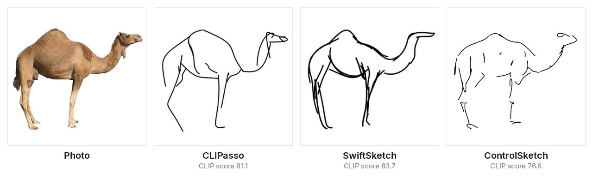
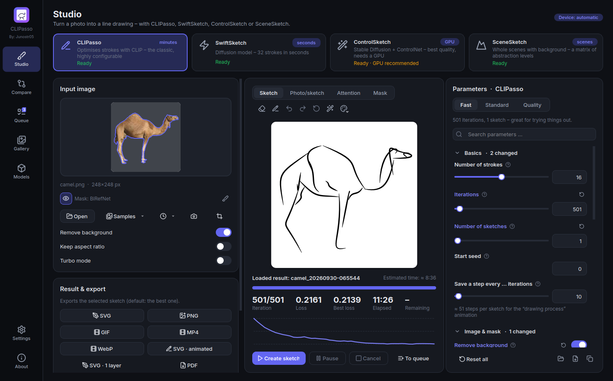
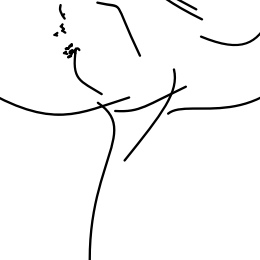
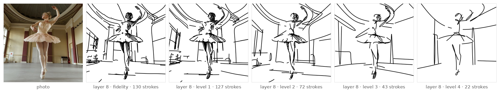
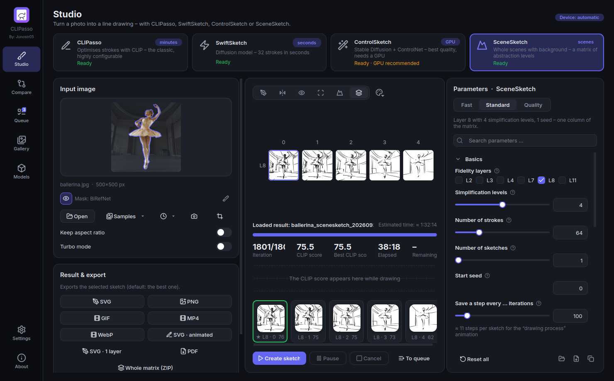
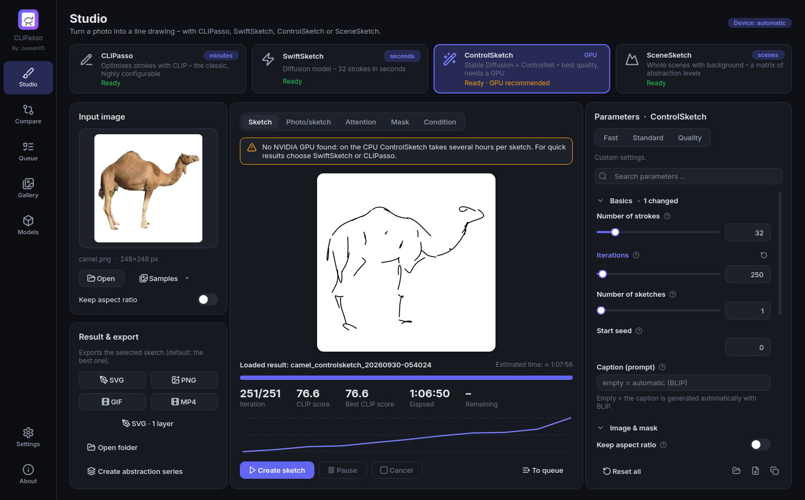
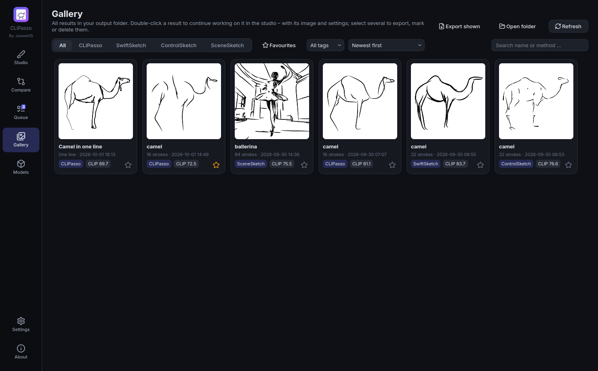
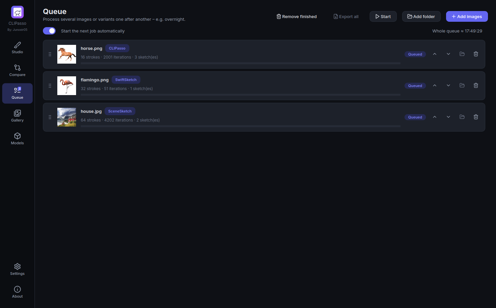
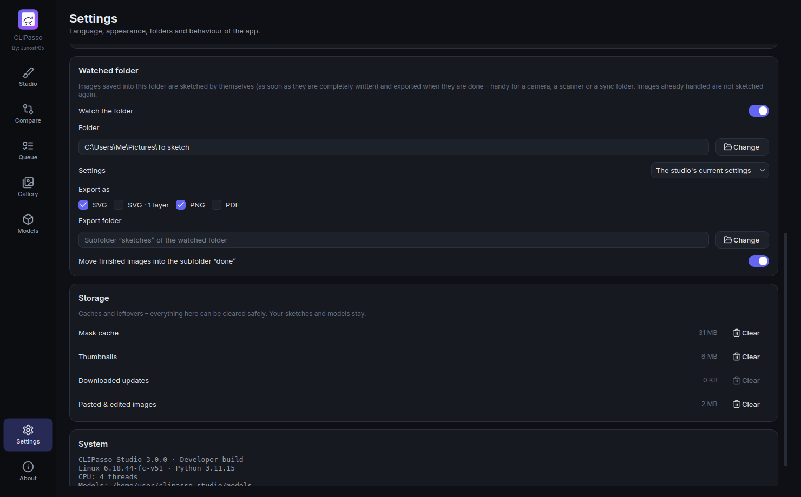

<p align="center">
  
</p>

<h1 align="center">CLIPasso Studio</h1>

<p align="center">
  A desktop app that turns photos into vector line drawings – with four methods in one interface:<br>
  <a href="https://github.com/yael-vinker/CLIPasso"><b>CLIPasso</b></a> (SIGGRAPH 2022) ·
  <a href="https://github.com/swiftsketch/SwiftSketch"><b>SwiftSketch</b></a> (SIGGRAPH 2025) ·
  <a href="https://github.com/swiftsketch/SwiftSketch"><b>ControlSketch</b></a> ·
  <a href="https://github.com/yael-vinker/SceneSketch"><b>SceneSketch</b></a> (ICCV 2023)<br>
  Every option adjustable, live preview, method comparison – all in a single exe.
</p>

<p align="center">
  <a href="https://github.com/Junostr05/CLIPasso-Studio/releases/latest"><b>⬇ Download (Windows)</b></a> ·
  <a href="#the-four-methods">Methods</a> ·
  <a href="#features">Features</a> ·
  <a href="#usage">Usage</a> ·
  <a href="#building-from-source">Build</a>
</p>

<p align="center">
  
</p>
<p align="center"><sub>Made with this app on a CPU: CLIPasso (16 strokes, “Fast” preset, 11 min), SwiftSketch (32 strokes, 4 s per sketch), ControlSketch (32 strokes – only 250 of the 2000 iterations, 67 min; with an NVIDIA GPU the full run takes a few minutes).</sub></p>



## Download

The [releases page](https://github.com/Junostr05/CLIPasso-Studio/releases/latest) has four variants:

| File | Description |
|---|---|
| **`CLIPassoStudio-CPU-Portable.zip`** (≈ 1 GB) | Portable without installation: unpack the ZIP anywhere (e.g. a USB stick) and start `CLIPassoStudio.exe` in it. Starts as fast as the installed app and updates itself (the new version is unpacked next to the old folder, which it then offers to delete). |
| **`CLIPassoStudio-CPU-Portable.exe`** (≈ 1 GB) | A single file: download, double-click, done. No installation and no Python needed. Everything CLIPasso needs is included; SwiftSketch, ControlSketch and SceneSketch download their models the first time you use them (see below). It unpacks itself on every start (15–40 s, with a splash screen). |
| **`CLIPassoStudio-CPU-Setup.exe`** (≈ 1 GB) | The same app as an installer: install once, then it starts quickly and gets Start menu and desktop shortcuts. No admin rights needed. Uninstalling asks whether the downloaded models and the app data should be removed too (your sketches always stay). |
| **`CLIPassoStudio-GPU-Setup.exe`** + `…-GPU-Setup-*.bin` (≈ 3.5 GB) | Edition for NVIDIA graphics cards (CUDA 12.8: GeForce GTX 16xx / RTX 20xx or newer, driver ≥ 570). CLIPasso and SceneSketch run 10–50× faster, and **ControlSketch is only practical with this edition**. Because it is larger than 2 GB, it is split into several files: **download all of them into the same folder** and run the `Setup.exe`. Without a suitable GPU it automatically falls back to the CPU. Can be installed next to the CPU edition (shortcut “CLIPasso Studio GPU”). **Older cards** (GTX 9xx / 10xx, e.g. a GTX 1060): from 3.1 the app detects them and offers an add-on with PyTorch for CUDA 12.6 (2.6 GB) – see below. |

> Windows SmartScreen may warn about an “unknown publisher” (the exe is not signed) → *More info* → *Run anyway*.

## The four methods

Pick the method at the top of the studio with one click. Parameters, presets, time estimate and hints adapt to it, and the settings of each method are remembered.

| | **CLIPasso** | **SwiftSketch** | **ControlSketch** | **SceneSketch** |
|---|---|---|---|---|
| How it works | Optimises Bézier strokes until CLIP “sees” the sketch like the photo | A diffusion model generates 32 strokes in 50 denoising steps, a refinement network polishes them | Optimises strokes with an SDS loss from Stable Diffusion 1.5, steered by a ControlNet (depth, edges …) | Sketches the object and the background of a scene separately (CLIP loss per ViT layer) and combines them; a second network removes strokes step by step |
| Best for | single objects | single objects | single objects | **whole scenes with background** |
| Speed | CPU: minutes · GPU: seconds to minutes | **CPU: ~5 s per sketch** | GPU: ~5–10 min · CPU: ~10 hours | CPU: ≈ 20 min per scene sketch · GPU: 1–2 min |
| Strokes | any number (1–256), multi-stage training | fixed at 32 (as trained) | any number (default 32) | 64 each for object and background, fewer with every simplification level |
| Models | included | ≈ 710 MB, downloaded on first use | ≈ 3–4 GB (SD 1.5, ControlNet, detector, BLIP), downloaded on first use | ≈ 200 MB (LaMa), downloaded on first use |
| Strengths | very configurable, level of abstraction, text guidance | lightning fast, clean “artist” strokes | very natural, detailed sketches | scenes, a whole matrix of abstraction levels |

<p align="center">
  
  
</p>
<p align="center"><sub>Left: CLIPasso optimises the strokes. Right: SwiftSketch forms them out of noise in 50 denoising steps (GIF export of the app).</sub></p>

**SceneSketch** draws whole scenes and produces a **matrix of sketches** instead of a single one: from precise to loose (fidelity – one column per CLIP layer) and from detailed to sparse (simplicity – strokes are removed step by step). The **Matrix** view of the studio shows all of them; click the one you like and export it.

<p align="center">
  
</p>
<p align="center"><sub>SceneSketch on the ballerina sample (CPU, “Standard” preset, about 2 hours): the photo, then fidelity layer 8 and its simplification levels – the same scene with fewer and fewer strokes.</sub></p>

**Which one suits my picture?** The **Compare** page sketches the current image with all selected methods (standard preset or your studio settings) and shows the results side by side – with CLIP score, compute time and stroke count – and highlights the method with the highest CLIP score. Earlier results for the same image are shown automatically.


## Features

- **Every option of the originals** in the interface, each with a tooltip, a reset button and search:
  - *CLIPasso*: every argument of `run_object_sketching.py` and `config.py` (strokes, iterations, seeds, mask, working resolution, stroke width, segments, curve type, initial SVG, CLIP/DINO saliency, XDoG, softmax temperature, text target, CLIP model, conv loss, layer weights, FC weight, CLIP/text guidance, L2/LPIPS, learning rates, scheduler, opacity, multi-stage training, augmentations …).
  - *SwiftSketch*: all options of `generate.py` – guidance strength, refinement on/off, also saving the diffusion sketch, aspect ratio, seed, plus background mask and stroke width.
  - *ControlSketch*: all options of `config.py` – strokes, iterations, prompt (or automatic via BLIP), ControlNet condition (depth, Canny, HED, scribble, segmentation, normals), ControlNet and guidance strength, timesteps, object size, working and output resolution, attention initialisation (CLIP, or SDXL with an object name), stroke sorting, learning rate …
  - *SceneSketch*: the options of `config.py`, `run_sketch.py` and the driver scripts – fidelity layers (2, 3, 4, 7, 8, 11), simplification levels and step sizes per layer, iterations of the object, background and simplification stages, object enlargement, strokes, saliency initialisation, learning rates, Gumbel temperature …
  - Checked by a test (`tests/test_settings.py`): every original argument has a setting with the same default value.
- **Live preview** for all methods: you watch the sketch being drawn (for SwiftSketch every denoising step). Plus a photo/sketch slider, the attention map with the stroke start points, the mask, the ControlNet condition image for ControlSketch, a loss or CLIP score curve, the remaining time and thumbnails of all seeds. **Several sketches per image – the best one is picked automatically** (CLIPasso: lowest loss; SwiftSketch and ControlSketch: highest CLIP score).
- **Presets** (Fast / Standard / Quality) per method, import/export of the settings as JSON, “copy command line”.
- **Turbo mode** (CLIPasso, ControlSketch, SceneSketch) – faster, with a slightly different result: the CLIP features of a fixed set of augmentations are computed once, only the best of several sketches is finished (the others stop at a quarter), and a sketch stops once it no longer improves; ControlSketch uses the small TAESD decoder, a 384 px working canvas and, on CPUs with AVX512-BF16/AMX, bfloat16. Measured on 4 CPU cores: CLIPasso 1.02 → 0.70 s per iteration (a standard job with 3 sketches about 3× faster with the pruning), ControlSketch 15.1 → 2.3 s per iteration.
- **One line** (CLIPasso): the subject in one single continuous stroke – the start points are joined into a short route and optimised as one path with many segments.
- **Draw yourself and continue**: draw your own strokes into a finished sketch with the **pen**, then *Continue with CLIPasso* – your strokes stay fixed, CLIPasso adds new ones around them.
- **Brush style live**: show the sketches in ink, pencil or marker right in the studio – also while they are being computed; the export starts with the same style.
- **Precise object mask with BiRefNet**: finds the object for all four methods – far more accurately than U²-Net (fine details like poles, hair or cables, several objects, busy backgrounds). Downloaded once (444 MB); *BiRefNet lite* (faster, 89 MB) or the original U²-Net can be picked per method (“Mask model”). Masks are cached, so the same image is not computed twice.
- **See and fix the mask before a run**: the studio shows the object on the input image as soon as you pick one. *Edit mask*: click a part to remove it, click next to the object to add an area of similar colour (magic wand), or paint with the brush – every method then uses your mask. Small objects in large photos are **framed automatically** so they fill the canvas (CLIPasso, SwiftSketch; can be switched off).
- **Touch-ups**: crop, rotate or flip the input image right in the studio; remove single strokes from a finished sketch with the **eraser** (with undo – the original stays).
- **Shape the result** (3.4): take a **saved step** as the result; **Simplify** with a slider – the strokes that add least go first (CLIP measures, once per sketch, how far the likeness falls without each stroke).
- **Detail brush & portrait mode** (3.4, CLIPasso and ControlSketch): paint where the sketch should get more detail and where less – more starting strokes there, the photo softened here. *Find face* (BlazeFace, offline) marks the eyes, nose and mouth by itself.
- **Best sketch** (3.4): the most similar one, **your taste** – thumbs up/down in the studio, learnt on this computer from 10 ratings on – or, experimentally, the most similar *and* cleanest one (LAION aesthetic score).
- **Time budget** (3.4): 5, 15 or 60 minutes or your own – iterations, number of sketches, turbo and augmentations are chosen so the job takes about that long on this computer.
- **Free aspect ratio**: export in the square of the method, **in the shape of the photo** or **cropped to the strokes** (with a margin) – the strokes stay vectors, only the frame changes. For every format, also when exporting many at once.
- **Export**: SVG (stroke colour, width, background, **brush style**: plain, ink, pencil, charcoal, chalk, ballpoint pen, marker, watercolour, neon or calligraphy; **paper** from 3.3: drawing paper, watercolour paper, kraft paper, linen or a blackboard, in any colour and with a vignette – also in the live preview), **SVG · 1 layer** (all strokes as one path in a single layer – for plotters, cutting machines such as Cricut or Silhouette, and laser software), PNG at any resolution, **PDF** (vector, for printing), **GIF / MP4 / animated WebP** – of the drawing process (for SwiftSketch: how the strokes emerge from noise) or **stroke by stroke** like by hand; you set how long the drawing takes and the frame rate follows. **SVG · animated**: an SVG that draws itself in the browser; from 3.3 also as **Lottie** (`.json` for websites, apps and After Effects) and as a **web page** of its own. **Print layout** (3.3): A5 to a 50 × 70 cm poster, margins, one sketch per page or a contact sheet, title, signature and names – as a multi-page PDF or straight to the printer. **Copy** (Ctrl+C) puts the sketch on the clipboard. SceneSketch: the **whole matrix** as one ZIP (every sketch as SVG and PNG plus an overview sheet). Abstraction series with one click (CLIPasso, ControlSketch).
- **Inputs**: JPEG, PNG, WebP, **HEIC/HEIF** (iPhone photos), **AVIF**, TIFF, BMP and GIF (photos are turned upright by their EXIF rotation), the clipboard, a **webcam photo** and the **recent images** menu.
- **Queue** for many images (a whole folder at once, or **drag & drop** images and folders), also with mixed methods: **reorder by dragging**, pause/cancel/retry per row, details with the settings that differ from the defaults (*Load into the studio*, *Replace by the studio settings*), the total time left, a notification when done and protection against sleep mode – and, for runs overnight, **sleep or shut down when done**. Failed jobs stay in the queue after a restart. **Export all** results of the queue – or all results the gallery shows – in one go.
- **Watched folder**: images saved into a chosen folder (e.g. by a scanner or a phone sync) are sketched by themselves with the studio settings or a preset and exported in the formats you pick; optionally moved into `done/` afterwards.
- **Models stay loaded** between the jobs of a queue, and on a CPU with enough cores and memory the sketches of a CLIPasso or SwiftSketch job run **in parallel**.
- **Continue interrupted jobs**: long runs save checkpoints; if the app or the PC closes (or you cancel), *Continue* picks up where it stopped – finished sketches are kept.
- **Gallery** of all results – fast also with thousands of sketches: click one to continue working on it in the studio – with its image and settings (every job keeps a copy of its input image, so this works even after the original was moved or deleted). **Multi-select** (Ctrl/Shift/rubber band) to delete, export or mark as favourite; **title, notes and tags** with a tag filter; sorting by date, score, duration, strokes or name; search, method filter, “Show folder”, keyboard control (arrows, Enter, Del, F, Ctrl+A). **Albums** (3.3): drag sketches onto an album, show, rename, export or print it.
- **Models** page grouped by method: download with progress, delete, manual import of the SwiftSketch weights (in case Google Drive hits its daily quota). Downloads check the free space first, are verified by checksum and continue where they stopped (also from another mirror); the **model folder** can be moved to another drive.
- **Dark/light theme**, **English/German** interface (follows the Windows language, switchable at runtime), keyboard shortcuts (Ctrl+V pastes an image, Ctrl+Enter starts), and a command-line mode that is compatible with the original arguments of all four methods.
- **Updates with one click** (download, checksum check, install – can be switched off, or *Check now*), with the release notes (*What's new?*); after an update the app shows what is new. From 3.2 on, an update downloads **only the files that changed** (a small patch; a new PyTorch still means the full package). Adjustable **interface size** (90–150 %), a short **guide** on the first start (again on the About page).
- **Older graphics cards** (GPU edition, from 3.1): NVIDIA cards older than the GTX 16xx are not in the app's PyTorch build (CUDA 12.8). The app detects them and offers a one-time add-on – the official PyTorch build with CUDA 12.6 (2.6 GB download, 4.1 GB on the disk) – and uses it automatically after a restart; newer cards are not affected. Settings → System: switch it on or off, remove it, and the switch *Always compute in fp32* (default fp16).
- **SDXL attention on cards below 8 GB** (ControlSketch, optional): SDXL needs about 7 GB of graphics memory. On a smaller card the app asks whether this one step runs piece by piece on the card (from 3.2; the weights wait in the RAM, about 9 GB), on the processor (about 75 min on 4 cores, faster with more; about 15 GB of RAM) or CLIP is used instead; the rest of ControlSketch stays on the graphics card.
- **Several graphics cards** (from 3.2): the sketches of a CLIPasso, SwiftSketch or ControlSketch job are spread over all cards, one per card.
- **Phone & messages** (3.3, much extended in 3.4): a **phone remote** in the home network – scan a QR code and control almost the whole studio from the phone: the picture (camera, gallery, files or from the PC), method, presets, every parameter, time budget, the detail brush, start / queue / pause / cancel, the live sketches, thumbs, downloads, the recent results and the queue (only from the local network, with an access code, off by default) – and a **Telegram message** with the finished sketch through your own bot.
- **Backup & move** (3.3): the settings, the queue with its pictures, the gallery and, if wanted, the models in one `.clipbackup` file – put back on a new computer with its own folders; nothing is overwritten, tokens are never in it.
- **Reliability**: before a job starts, a **memory guard** checks the RAM and the graphics memory and suggests smaller settings; when the graphics memory still runs out, the app offers to continue on the CPU or with smaller settings (finished sketches are kept); a **self-test** of all methods and **Report a problem …** (a prepared GitHub issue with the diagnostics) in Settings → System; a **crash log** with the Python stacks also of a crashed worker process; **Copy / save diagnostics** (version, system, GPU, folders, models, last log lines) for a bug report; a **storage** overview that clears caches, old updates and pasted images; when the output folder changes, the results can move along.

<p>
  
  
  
  
  
  
</p>

## Usage

1. Choose the method at the top. If models are missing, one click on **Download** in the notice bar is enough.
2. Drag an image onto **Input image** (or use *Open* / *Samples*). For non-square images, turn on **Keep aspect ratio**.
3. Pick a preset, adjust parameters if you like, and click **Create sketch**.
4. Export the best sketch (★) as SVG/PNG/GIF/MP4. The results are also saved in the output folder (default: `Documents\CLIPasso Studio`) – for every run `best_iter.svg`, `svg_logs/`, `config.json` (including the CLIP score) and `<run>_best.svg`.

**Compute time (CPU):** SwiftSketch ~5 s per sketch. CLIPasso: *Fast* preset 5–15 min, *Standard* 45–90 min. SceneSketch: *Fast* ≈ 20 min (one scene sketch), *Standard* ≈ 2 h (one column of the matrix), the full matrix of the paper many hours – with an NVIDIA GPU minutes to about an hour. ControlSketch needs about 10 hours per sketch on a CPU – a few minutes with an NVIDIA GPU.

**CLIP score:** the cosine similarity (in %) of the CLIP ViT-B/32 image features of the sketch and the (masked) input image. It is computed the same way for every method, which makes them comparable – in the end, go with your taste.

### Command line

```bat
CLIPassoStudio.exe --cli --target_file camel.png --num_strokes 16 --mask_object 1 --num_sketches 3
CLIPassoStudio.exe --cli --method swiftsketch --input_data camel.png --guidance_param 2.5 --num_sketches 4
CLIPassoStudio.exe --cli --method controlsketch --target camel.png --condition depth --caption "a camel"
CLIPassoStudio.exe --cli --method scenesketch --target_file ballerina.jpg --layers 2,8,11 --simplicity_levels 4
CLIPassoStudio.exe --cli --method swiftsketch --help
```

In CLI mode, missing models are downloaded automatically (`--no_download` prevents that).

## How it works / differences from the originals

**CLIPasso** – the original code (painter, loss, optimisation, selection of the best sketch), ported to Python 3.11 / PyTorch 2.11:
- **Renderer:** instead of the C++/CUDA rasteriser *diffvg*, which is hard to build on Windows, the app uses a **differentiable Bézier renderer in pure PyTorch** (`clipasso_studio/engine/renderer.py`, gradients tested against finite differences). All four methods use it. Since 3.0 it bounds every Bézier segment separately and computes the distance with gradient only for the nearest segment: a CLIPasso render step takes 47–62 instead of 68–152 ms, a single line of 48 segments 40 instead of 4059 ms, ControlSketch 639 instead of 1752 ms (same image as before; gradients equal up to float summation order, so results are not bit-identical to 2.4).
- **Bugs of the original fixed**, so that every option works: `percep_loss` (L2/LPIPS) and `clip_text_guide` were not wired up, `lr_scheduler` called a missing function, the “Cos” conv loss crashed for ResNets, `num_stages` was not implemented in the main loop, and `mask_object_attention`, `augment_both`, `include_target_in_aug` and `aug_scale_min` had no effect.

**SwiftSketch** – an independent implementation of the transformer decoder, the DDPM sampler (cosine schedule, x₀ prediction, classifier-free guidance) and the refinement step; the original repository has no licence file, so no code is copied. It loads the **authors' official weights** unchanged and was checked against the original code: identical network outputs (max. difference 0.0) and sampler steps (≤ 1.4·10⁻⁶). One difference: the background mask comes from BiRefNet (or U²-Net) instead of BRIA RMBG-1.4, whose licence does not allow redistribution.

**ControlSketch** – also an independent implementation, built on 🤗 diffusers. Differences from the original:
- By default the stroke initialisation uses **CLIP attention** (bundled) instead of SDXL cross-attention; SDXL (≈ 7 GB) can be selected as soon as an object name is given.
- Automatic captions with **BLIP** (0.9 GB) instead of BLIP-2 OPT-2.7b (15 GB); entering your own prompt skips this.
- Condition images without OpenCV/controlnet_aux: depth with MiDaS DPT-Hybrid (the same network), Canny as a NumPy port of `cv2.Canny` (compared with OpenCV in a test), HED as a port of the Apache-2.0 network, segmentation with UperNet. **Normals** are computed from the depth as described in the ControlNet 1.0 model card (the original uses NormalBae + ControlNet 1.1).
- BiRefNet (or U²-Net) instead of RMBG-1.4 – and the background removal can be switched off (the original always sketches the object only), K-means in NumPy instead of scikit-learn, the PyTorch renderer instead of diffvg; there is no `lr_scheduler` option because the original never uses it.

**SceneSketch** – ported from the MIT-licensed original code (painter with the stroke and width MLPs, loss with gradient-norm balancing, the fidelity and simplification scripts, the matrix combination). Differences from the original:
- The PyTorch renderer instead of diffvg; the ViT is only evaluated up to the deepest layer the loss needs (same values, faster for shallow layers).
- LaMa runs as a port of its generator network (Apache-2.0) with float16 weights, checked against the reference model (identical output with the original weights). The object mask comes from BiRefNet by default; U²-Net (the original's network) uses SceneSketch's own preprocessing.
- The object and background sketches are combined as vectors: background strokes are cut exactly at the object outline instead of being whited out in a raster image, so every cell of the matrix is a plain stroke SVG.
- The ratio loss of the simplification only decides *how many* strokes remain; in the original it also moves the strokes, and when a level lowers the target the quickest way to meet it is to make the sketch worse – objects visibly scrambled (the ballerina at level 2). Here each level is a clean, sparser version of the previous one.
- Fewer than 8 simplification levels span the same range with larger steps; objects on a plain background (e.g. product photos) skip the background sketch.

**Object mask** – BiRefNet (MIT) runs as a port of its network (`clipasso_studio/engine/birefnet.py`: Swin-L backbone for the general model, Swin-T for the lite one, deformable ASPP decoder), without timm, kornia, einops or remote code from the Hub; checked against the original code with the real weights (identical outputs). On the CPU the deformable convolutions use a `grid_sample` implementation that is about 2.5× faster than torchvision's (same results up to float rounding). The original CLIPasso and SceneSketch use U²-Net, SwiftSketch and ControlSketch BRIA RMBG-1.4; BiRefNet replaces both by default, U²-Net stays selectable. Masks edited in the app are stored per image content and used instead of the model by every method. *Fit the object* (CLIPasso, SwiftSketch) is not in the originals: with the background removed, a small object is cropped to fill 85 % of the canvas. Jobs interrupted with an older version continue with U²-Net and without framing, so their sketches match.

The SwiftSketch, ControlSketch, SceneSketch and BiRefNet models are not bundled: they are downloaded from the official sources on first use (the authors' Google Drive, Hugging Face with pinned revisions, and the LaMa export of IOPaint on GitHub) and stored locally (ControlSketch, LaMa and BiRefNet models in float16).

## Building from source

```bash
python -m venv .venv && .venv\Scripts\activate           # Python 3.11
pip install -r requirements/torch-cpu.txt                 # or torch-gpu.txt
pip install -r requirements/dev.txt -r requirements/build.txt
python tools/fetch_models.py                              # ~800 MB of bundled models into ./models
python -m clipasso_studio                                 # run the app from source
python -m pytest -q                                       # tests (SwiftSketch/ControlSketch with tiny models)
python -m clipasso_studio --selftest out                  # short run of all three methods
set MODE=onefile&& pyinstaller packaging\clipasso_studio.spec   # portable exe
```

The complete Windows build (both editions, installers, self-test of the exe and the release) runs in [`.github/workflows/build.yml`](.github/workflows/build.yml). A manual run (*Run workflow* with a `release_tag`) creates a release; the `cpu` and `gpu` switches build the editions separately.

## Credits & licence

### The methods

- **CLIPasso** – Yael Vinker, Ehsan Pajouheshgar, Jessica Y. Bo, Roman Christian Bachmann, Amit Haim Bermano, Daniel Cohen-Or, Amir Zamir, Ariel Shamir: *CLIPasso: Semantically-Aware Object Sketching*, ACM TOG (SIGGRAPH 2022) – [Paper](https://arxiv.org/abs/2202.05822) · [Project](https://clipasso.github.io/clipasso/) · [Code](https://github.com/yael-vinker/CLIPasso).
- **SwiftSketch / ControlSketch** – Ellie Arar, Yarden Frenkel, Daniel Cohen-Or, Ariel Shamir, Yael Vinker: *SwiftSketch: A Diffusion Model for Image-to-Vector Sketch Generation*, SIGGRAPH 2025 – [Paper](https://arxiv.org/abs/2502.08642) · [Project](https://swiftsketch.github.io/) · [Code](https://github.com/swiftsketch/SwiftSketch).
- **SceneSketch (CLIPascene)** – Yael Vinker, Yuval Alaluf, Daniel Cohen-Or, Ariel Shamir: *CLIPascene: Scene Sketching with Different Types and Levels of Abstraction*, ICCV 2023 – [Paper](https://arxiv.org/abs/2211.17256) · [Project](https://clipascene.github.io/CLIPascene/) · [Code](https://github.com/yael-vinker/SceneSketch). The sample scenes (ballerina, house) come from its repository.
- **LaMa** – Roman Suvorov et al.: *Resolution-robust Large Mask Inpainting with Fourier Convolutions*, WACV 2022 – [Code](https://github.com/advimman/lama).
- **TAESD** – Ollin Boer Bohan: *Tiny AutoEncoder for Stable Diffusion* (MIT), used by the turbo mode of ControlSketch – [Code](https://github.com/madebyollin/taesd).
- **BiRefNet** – Peng Zheng, Dehong Gao, Deng-Ping Fan, Li Liu, Jorma Laaksonen, Wanli Ouyang, Nicu Sebe: *Bilateral Reference for High-Resolution Dichotomous Image Segmentation*, CAAI Artificial Intelligence Research 2024 – [Code](https://github.com/ZhengPeng7/BiRefNet) · [Weights](https://huggingface.co/ZhengPeng7/BiRefNet).

### The app

**[Junostr05](https://github.com/Junostr05)** – idea for CLIPasso Studio, GUI vision and UI/UX direction: bringing these research methods into one proper desktop application.

### Licence

Like CLIPasso, this app is licensed under **[CC BY-NC-SA 4.0](LICENSE)** – **non-commercial use only**. The SwiftSketch weights are provided by the authors without an explicit licence (research/personal use); Stable Diffusion 1.5 and ControlNet are licensed under CreativeML OpenRAIL-M, which comes with use restrictions; SceneSketch (MIT) and LaMa (Apache-2.0) are open source. All components and licences: [THIRD_PARTY_NOTICES.md](THIRD_PARTY_NOTICES.md).
