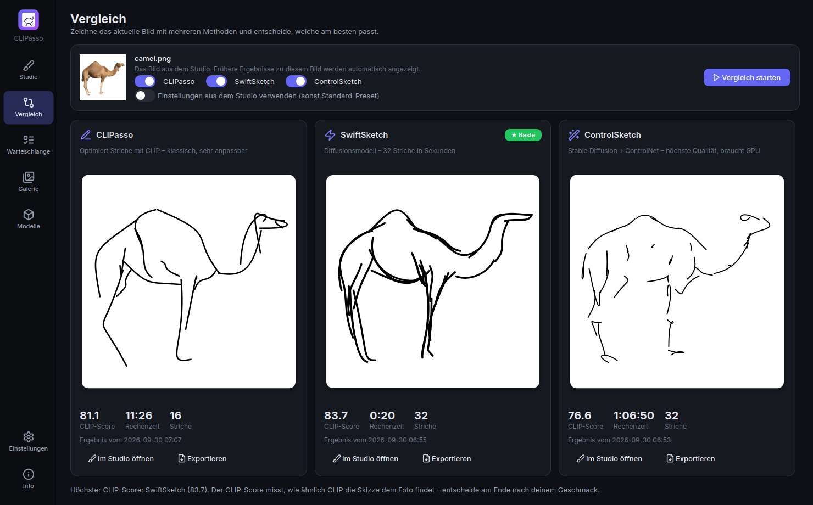
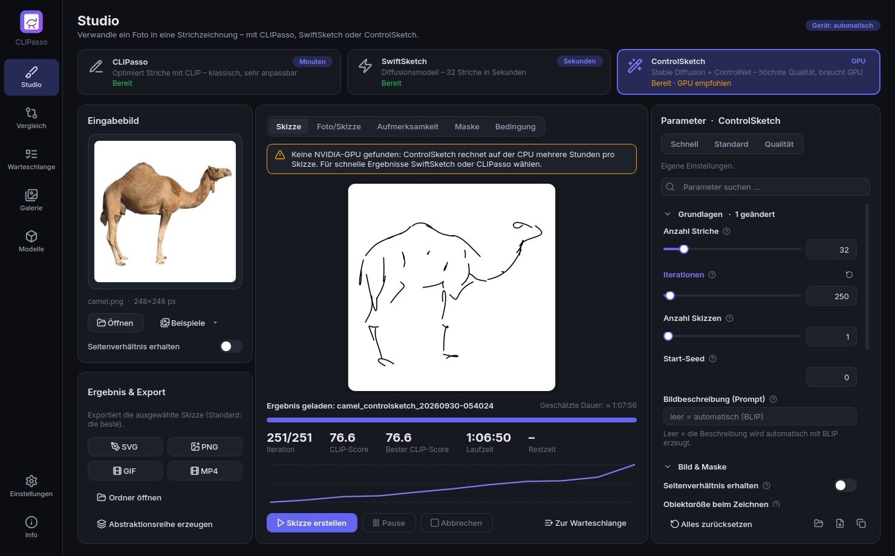

<p align="center">
  
</p>

<h1 align="center">CLIPasso Studio</h1>

<p align="center">
  Desktop-App, die Fotos in Vektor-Strichzeichnungen verwandelt – mit drei Verfahren in einer Oberfläche:<br>
  <a href="https://github.com/yael-vinker/CLIPasso"><b>CLIPasso</b></a> (SIGGRAPH 2022) ·
  <a href="https://github.com/swiftsketch/SwiftSketch"><b>SwiftSketch</b></a> (SIGGRAPH 2025) ·
  <a href="https://github.com/swiftsketch/SwiftSketch"><b>ControlSketch</b></a><br>
  Alle Optionen einstellbar, Live-Vorschau, Methodenvergleich, alles in einer EXE.
</p>

<p align="center">
  <a href="https://github.com/Junostr05/CLIPasso-Studio/releases/latest"><b>⬇ Download (Windows)</b></a> ·
  <a href="#die-drei-methoden">Methoden</a> ·
  <a href="#funktionen">Funktionen</a> ·
  <a href="#bedienung">Bedienung</a> ·
  <a href="#english">English</a>
</p>

<p align="center">
  
</p>
<p align="center"><sub>Mit dieser App auf einer CPU erzeugt: CLIPasso (16 Striche, Preset „Schnell“, 11 Min.), SwiftSketch (32 Striche, 4 s pro Skizze), ControlSketch (32 Striche – nur 250 der 2000 Iterationen, 67 Min.; mit einer NVIDIA-GPU läuft der volle Durchlauf in wenigen Minuten).</sub></p>


## Download

Auf der [Release-Seite](https://github.com/Junostr05/CLIPasso-Studio/releases/latest) liegen drei Varianten:

| Datei | Beschreibung |
|---|---|
| **`CLIPassoStudio-CPU-Portable.exe`** | Eine einzige Datei: herunterladen, doppelklicken, fertig. Keine Installation, keine Python-Umgebung. Alles für CLIPasso ist enthalten; SwiftSketch und ControlSketch laden ihre Modelle beim ersten Einsatz (siehe unten). Beim Start wird kurz entpackt (15–40 s, mit Splash-Screen). |
| **`CLIPassoStudio-CPU-Setup.exe`** | Dieselbe App als Installer: einmal installieren, danach schneller Start, Startmenü- und Desktop-Verknüpfung. Keine Admin-Rechte nötig. |
| **`CLIPassoStudio-GPU-Setup.exe`** + `…-GPU-Setup-*.bin` | Edition für NVIDIA-Grafikkarten (CUDA 12.8: GeForce GTX 16xx / RTX 20xx oder neuer, Treiber ≥ 570). CLIPasso wird 10–50× schneller, **ControlSketch ist nur hiermit praktikabel**. Weil sie größer als 2 GB ist, besteht sie aus mehreren Dateien: **alle in denselben Ordner laden** und die `Setup.exe` starten. Ohne passende GPU rechnet sie automatisch auf der CPU. |

> Windows SmartScreen warnt eventuell vor einem „unbekannten Herausgeber“ (die EXE ist nicht signiert) → *Weitere Informationen* → *Trotzdem ausführen*.

## Die drei Methoden

Oben im Studio wählst du die Methode per Klick; Parameter, Presets, Zeitschätzung und Hinweise passen sich an, die Einstellungen jeder Methode werden gemerkt.

| | **CLIPasso** | **SwiftSketch** | **ControlSketch** |
|---|---|---|---|
| Verfahren | Optimiert Bézier-Striche, bis CLIP die Skizze wie das Foto „sieht“ | Diffusionsmodell erzeugt 32 Striche in 50 Entrauschungsschritten, ein Refinement-Netz poliert sie | Optimiert Striche mit einem SDS-Loss aus Stable Diffusion 1.5, gesteuert von einem ControlNet (Tiefe, Kanten …) |
| Tempo | CPU: Minuten · GPU: Sekunden–Minuten | **CPU: ~5 s pro Skizze** | GPU: ~5–10 min · CPU: viele Stunden |
| Striche | frei wählbar (1–256), Mehrstufen-Training | fest 32 (so trainiert) | frei wählbar (Standard 32) |
| Modelle | enthalten | ≈ 710 MB, beim ersten Einsatz | ≈ 3–4 GB (SD 1.5, ControlNet, Detektor, BLIP), beim ersten Einsatz |
| Stärken | sehr anpassbar, Abstraktionsgrad, Text-Führung | blitzschnell, sauberer „Künstler“-Strich | sehr natürliche, detailreiche Skizzen |

<p align="center">
  
  
</p>
<p align="center"><sub>Links: CLIPasso optimiert die Striche. Rechts: SwiftSketch formt sie in 50 Entrauschungsschritten aus Rauschen (GIF-Export der App).</sub></p>

**Welche passt zu meinem Bild?** Die Seite **Vergleich** zeichnet das aktuelle Bild mit allen gewählten Methoden (Standard-Preset oder deine Studio-Einstellungen), stellt die Ergebnisse nebeneinander – mit CLIP-Score, Rechenzeit und Strichzahl – und markiert die Methode mit dem höchsten CLIP-Score. Frühere Ergebnisse zum selben Bild werden automatisch angezeigt.



## Funktionen

- **Alle Optionen der Originale** in der Oberfläche, jeweils mit Tooltip, Reset und Suche:
  - *CLIPasso*: jedes Argument von `run_object_sketching.py` und `config.py` (Striche, Iterationen, Seeds, Maske, Arbeitsauflösung, Strichbreite, Segmente, Kurventyp, Start-SVG, Saliency CLIP/DINO, XDoG, Softmax-Temperatur, Text-Ziel, CLIP-Modell, Conv-Loss, Layer-Gewichte, FC-Gewicht, CLIP-/Text-Führung, L2/LPIPS, Lernraten, Scheduler, Deckkraft, Mehrstufen-Training, Augmentierungen …).
  - *SwiftSketch*: alle Optionen von `generate.py` – Guidance-Stärke, Refinement an/aus, Diffusions-Skizze zusätzlich speichern, Seitenverhältnis, Seed, dazu Hintergrund-Maske und Strichbreite.
  - *ControlSketch*: alle Optionen von `config.py` – Striche, Iterationen, Prompt (oder automatisch per BLIP), ControlNet-Bedingung (Tiefe, Canny, HED, Scribble, Segmentierung, Normalen), ControlNet-/Guidance-Stärke, Zeitschritte, Objektgröße, Arbeits- und Ausgabeauflösung, Aufmerksamkeits-Initialisierung (CLIP oder SDXL mit Objektname), Strich-Sortierung, Lernrate …
  - Per Test geprüft (`tests/test_settings.py`): jedes Original-Argument hat eine Einstellung mit demselben Standardwert.
- **Live-Vorschau** für alle Methoden: die Skizze entsteht sichtbar (bei SwiftSketch jeder Entrauschungsschritt). Dazu Foto/Skizze-Schieberegler, Aufmerksamkeitskarte mit Startpunkten, Maske, bei ControlSketch das ControlNet-Bedingungsbild, Loss- bzw. CLIP-Score-Kurve, Restzeit und Miniaturen aller Seeds. **Mehrere Skizzen pro Bild – die beste wird automatisch gewählt** (CLIPasso: geringster Loss, SwiftSketch/ControlSketch: höchster CLIP-Score).
- **Presets** (Schnell / Standard / Qualität) pro Methode, Import/Export der Einstellungen als JSON, „CLI-Befehl kopieren“.
- **Export**: SVG (Strichfarbe, -stärke, Hintergrund), PNG in beliebiger Auflösung, **GIF/MP4 des Zeichenprozesses** – bei SwiftSketch, wie sich die Striche aus dem Rauschen formen. Abstraktionsreihe auf Knopfdruck (CLIPasso, ControlSketch).
- **Warteschlange** für viele Bilder und Methoden gemischt, mit Pause/Abbruch, Benachrichtigung und Schutz vor dem Energiesparmodus. **Galerie** mit Methoden-Filter.
- **Modelle**-Seite nach Methoden gruppiert: Download mit Fortschritt, Löschen, manueller Import der SwiftSketch-Gewichte (falls Google Drive das Tageskontingent erreicht).
- **Dark/Light-Theme**, **Deutsch/Englisch** (live umschaltbar), Kommandozeilenmodus, der mit den Original-Argumenten aller drei Methoden kompatibel ist.

<p>
  
  
</p>

## Bedienung

1. Methode oben wählen (fehlen Modelle, genügt ein Klick auf **Herunterladen** im Hinweisbalken).
2. Bild per Drag & Drop in **Eingabebild** ziehen (oder *Öffnen* / *Beispiele*). Bei nicht-quadratischen Bildern **Seitenverhältnis erhalten** aktivieren.
3. Preset wählen, bei Bedarf Parameter anpassen und auf **Skizze erstellen** klicken.
4. Die beste Skizze (★) als SVG/PNG/GIF/MP4 exportieren. Die Ergebnisse liegen außerdem im Ausgabeordner (Standard: `Dokumente\CLIPasso Studio`) – pro Lauf `best_iter.svg`, `svg_logs/`, `config.json` (inkl. CLIP-Score) und `<run>_best.svg`.

**Rechenzeit (CPU):** SwiftSketch ~5 s pro Skizze. CLIPasso: Preset *Schnell* 5–15 min, *Standard* 45–90 min. ControlSketch braucht auf der CPU mehrere Stunden pro Skizze – mit einer NVIDIA-GPU wenige Minuten.

**CLIP-Score:** Kosinus-Ähnlichkeit (in %) der CLIP-ViT-B/32-Bildmerkmale von Skizze und (maskiertem) Eingabebild. Er ist für alle Methoden gleich berechnet und macht sie vergleichbar; die letzte Entscheidung trifft dein Geschmack.

### Kommandozeile

```bat
CLIPassoStudio.exe --cli --target_file camel.png --num_strokes 16 --mask_object 1 --num_sketches 3
CLIPassoStudio.exe --cli --method swiftsketch --input_data camel.png --guidance_param 2.5 --num_sketches 4
CLIPassoStudio.exe --cli --method controlsketch --target camel.png --condition depth --caption "a camel"
CLIPassoStudio.exe --cli --method swiftsketch --help
```

Fehlende Modelle werden im CLI-Modus automatisch heruntergeladen (`--no_download` verhindert das).

## Wie es funktioniert / Unterschiede zu den Originalen

**CLIPasso** – der Code des Originals (Painter, Loss, Optimierung, Auswahl der besten Skizze), portiert auf Python 3.11 / PyTorch 2.11:
- **Renderer:** Statt des C++/CUDA-Rasterizers *diffvg*, der sich unter Windows kaum bauen lässt, nutzt die App einen **differenzierbaren Bézier-Renderer in reinem PyTorch** (`clipasso_studio/engine/renderer.py`, Gradienten gegen Finite Differences getestet). Er wird von allen drei Methoden verwendet.
- **Behobene Fehler des Originals**, damit jede Option funktioniert: `percep_loss` (L2/LPIPS) und `clip_text_guide` waren nicht angeschlossen, `lr_scheduler` rief eine fehlende Funktion auf, der „Cos“-Conv-Loss für ResNets stürzte ab, `num_stages` war im Hauptloop nicht umgesetzt, `mask_object_attention`, `augment_both`, `include_target_in_aug` und `aug_scale_min` hatten keine Wirkung.

**SwiftSketch** – eigene Implementierung (das Original-Repository hat keine Lizenzdatei, daher wird kein Code übernommen) von Transformer-Decoder, DDPM-Sampler (Cosinus-Schedule, x₀-Vorhersage, Classifier-free Guidance) und Refinement. Sie lädt die **offiziellen Gewichte der Autoren** unverändert; gegen den Original-Code geprüft: identische Netzausgaben (max. Abweichung 0,0) und Sampler-Schritte (≤ 1,4·10⁻⁶). Unterschied: Die Hintergrundmaske kommt von U²-Net statt BRIA RMBG-1.4 (dessen Lizenz ist nicht-kommerziell und der Zugang beschränkt).

**ControlSketch** – ebenfalls eigene Implementierung auf Basis von 🤗 diffusers. Unterschiede zum Original:
- Aufmerksamkeits-Initialisierung standardmäßig mit **CLIP** (enthalten) statt SDXL-Cross-Attention; SDXL (≈ 7 GB) ist wählbar, sobald ein Objektname angegeben ist.
- Automatische Bildbeschreibung mit **BLIP** (0,9 GB) statt BLIP-2 OPT-2.7b (15 GB); ein eigener Prompt überspringt das.
- Bedingungsbilder ohne OpenCV/controlnet_aux: Tiefe mit MiDaS DPT-Hybrid (dasselbe Netz), Canny als NumPy-Port von `cv2.Canny` (per Test mit OpenCV verglichen), HED als Port des Apache-2.0-Netzes, Segmentierung mit UperNet. **Normalen** werden wie in der Model Card von ControlNet 1.0 aus der Tiefe berechnet (das Original nutzt NormalBae + ControlNet 1.1).
- U²-Net statt RMBG-1.4, K-Means in NumPy statt scikit-learn, PyTorch-Renderer statt diffvg; `lr_scheduler` fehlt, weil das Original ihn nicht verwendet.

Die Modelle von SwiftSketch und ControlSketch werden nicht mitgeliefert, sondern beim ersten Einsatz von den offiziellen Quellen geladen (Google Drive der Autoren bzw. Hugging Face mit festen Revisionen) und lokal gespeichert (ControlSketch-Modelle in float16).

## Selbst bauen

```bash
python -m venv .venv && .venv\Scripts\activate           # Python 3.11
pip install -r requirements/torch-cpu.txt                 # oder torch-gpu.txt
pip install -r requirements/dev.txt -r requirements/build.txt
python tools/fetch_models.py                              # ~800 MB mitgelieferte Modelle nach ./models
python -m clipasso_studio                                 # App aus dem Quellcode starten
python -m pytest -q                                       # Tests (SwiftSketch/ControlSketch mit Mini-Modellen)
python -m clipasso_studio --selftest out                  # Kurzlauf aller drei Methoden
set MODE=onefile&& pyinstaller packaging\clipasso_studio.spec   # portable EXE
```

Der komplette Windows-Build (beide Editionen, Installer, Selbsttest der EXE und Release) läuft in [`.github/workflows/build.yml`](.github/workflows/build.yml). Ein manueller Lauf (*Run workflow* mit `release_tag`) erzeugt ein Release.

## Lizenz & Credits

- **CLIPasso** – Yael Vinker, Ehsan Pajouheshgar, Jessica Y. Bo, Roman Christian Bachmann, Amit Haim Bermano, Daniel Cohen-Or, Amir Zamir, Ariel Shamir: *CLIPasso: Semantically-Aware Object Sketching*, ACM TOG (SIGGRAPH 2022) – [Paper](https://arxiv.org/abs/2202.05822) · [Projekt](https://clipasso.github.io/clipasso/) · [Code](https://github.com/yael-vinker/CLIPasso).
- **SwiftSketch / ControlSketch** – Ellie Arar, Yarden Frenkel, Daniel Cohen-Or, Ariel Shamir, Yael Vinker: *SwiftSketch: A Diffusion Model for Image-to-Vector Sketch Generation*, SIGGRAPH 2025 – [Paper](https://arxiv.org/abs/2502.08642) · [Projekt](https://swiftsketch.github.io/) · [Code](https://github.com/swiftsketch/SwiftSketch).

Wie CLIPasso steht diese App unter **[CC BY-NC-SA 4.0](LICENSE)**, also **nur für nicht-kommerzielle Nutzung**. Die SwiftSketch-Gewichte stellen die Autoren ohne ausdrückliche Lizenz bereit (Forschung/private Nutzung); Stable Diffusion 1.5 und ControlNet stehen unter CreativeML OpenRAIL-M mit Nutzungsbeschränkungen. Alle Komponenten und Lizenzen: [THIRD_PARTY_NOTICES.md](THIRD_PARTY_NOTICES.md).

---

## English

**CLIPasso Studio** is a Windows desktop app that turns photos into vector line drawings with three methods in one interface: [CLIPasso](https://github.com/yael-vinker/CLIPasso) (SIGGRAPH 2022), [SwiftSketch](https://github.com/swiftsketch/SwiftSketch) (SIGGRAPH 2025) and ControlSketch.

- **Download** from the [releases page](https://github.com/Junostr05/CLIPasso-Studio/releases/latest): the portable CPU exe (single file, no installation), the CPU installer, or the NVIDIA GPU edition (`CLIPassoStudio-GPU-Setup.exe` plus all `.bin` parts in one folder; GTX 16xx / RTX 20xx or newer, CUDA 12.8, driver ≥ 570).
- **Pick the method** at the top of the studio: *CLIPasso* optimises strokes with CLIP (everything bundled, very configurable); *SwiftSketch* generates 32 strokes with a diffusion model in about 5 seconds on a CPU (≈ 710 MB of weights downloaded on first use); *ControlSketch* optimises strokes with Stable Diffusion 1.5 + ControlNet for very natural sketches (≈ 3–4 GB of models, practical only on an NVIDIA GPU).
- The **Compare** page sketches the current image with several methods and shows the results side by side with their CLIP score, compute time and stroke count; the best one is highlighted.
- **Every option** of the original scripts of all three methods is available in the GUI and in `CLIPassoStudio.exe --cli --method …` (original argument names; missing models are downloaded automatically).
- **Live preview**, several sketches per image with automatic selection of the best, export to SVG/PNG/GIF/MP4, a mixed-method **queue**, a **gallery** with a method filter, a **models** page, dark/light theme, German/English UI.
- SwiftSketch and ControlSketch are independent re-implementations (the original repository has no licence file); SwiftSketch loads the authors' official weights and reproduces the reference outputs. Differences to the originals are listed above (U²-Net instead of RMBG-1.4, BLIP instead of BLIP-2, CLIP attention as the default ControlSketch initialisation, condition detectors without OpenCV, pure-PyTorch rasteriser instead of diffvg).
- **Licence:** CC BY-NC-SA 4.0, non-commercial use only, like CLIPasso. Downloaded models keep their own licences (see [THIRD_PARTY_NOTICES.md](THIRD_PARTY_NOTICES.md)).
